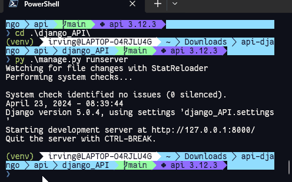
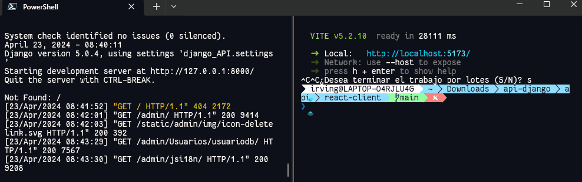
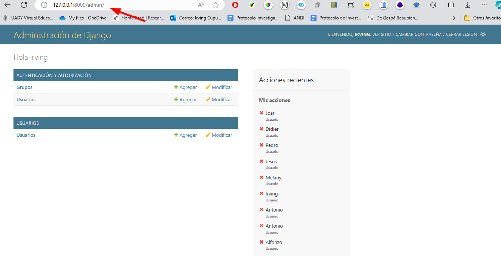
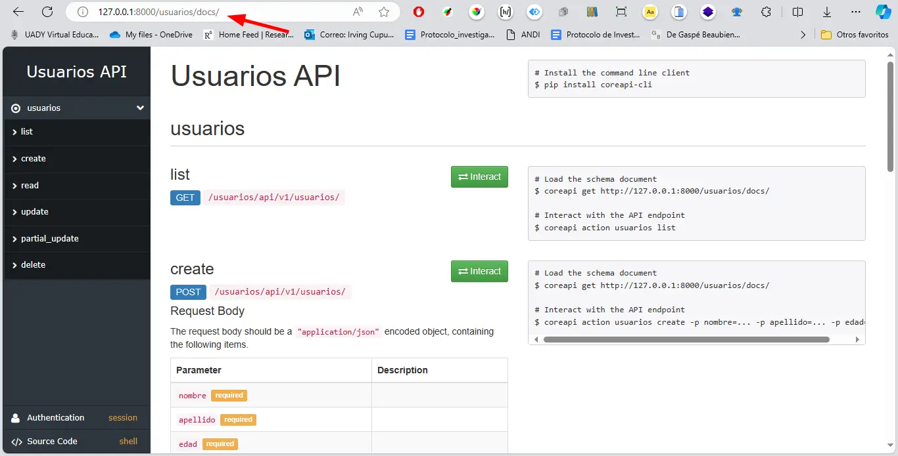
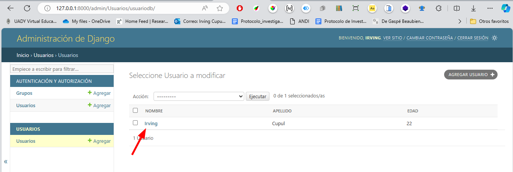
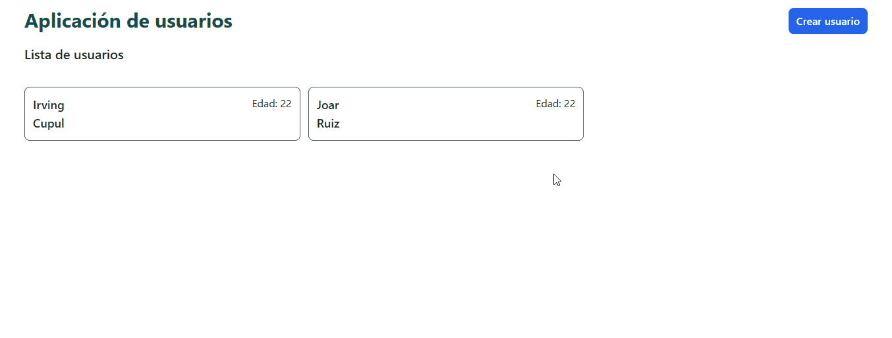
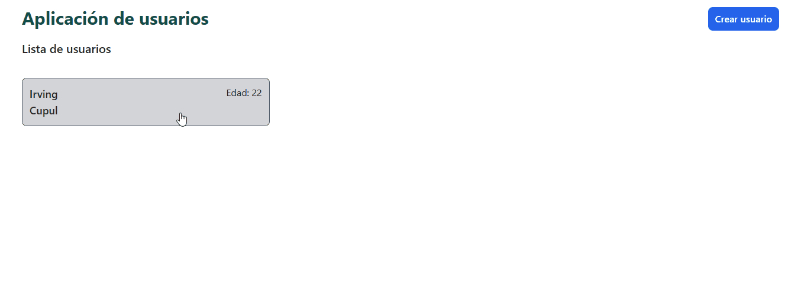

<div align="center">
  <p style="font-size:32px;font-weight:bold;">
    <b>
      REST con Django🐍 y un cliente con React ⚛
    </b>
  </p>
</div>


</div>

## 🐍 Descripción

Esta es una exposición de como implemetar REST con [**Django**](https://www.djangoproject.com) , utilizando [**Django Rest Framework**](https://www.django-rest-framework.org/) en la parte del backend y utilizando [**React**](https://es.react.dev/) para el desarrollo de una aplicación web como cliente.

Estas son las tecnologías que se utilizan en el backend para REST [django_API](django_API/):


- [**Django**](https://www.djangoproject.com)
- [**Django Rest Framework**](https://www.django-rest-framework.org/)
- [**Cors-header**](https://pypi.org/project/django-cors-headers/)
- [**Core API**](https://pypi.org/project/coreapi/)

Y estas son las tecologías para la aplicación web con React [react-client](react-client/):
- [**React**](https://es.react.dev/)
- [**Vite**](https://vitejs.dev/)
- [**react-router-dom**](https://www.npmjs.com/package/react-router-dom)
- [**react-hot-toast**](https://www.npmjs.com/package/react-hot-toast)
- [**axios**](https://www.npmjs.com/package/axios)
- [**react-hook-form**](https://www.npmjs.com/package/react-hook-form)
- [**TailwindCSS**](https://tailwindcss.com)
- [**Prettier**](https://prettier.io) 


## 🚀 Comenzar el proyecto

**1 Requerimientos:**

- REST
  - [x] [Python](https://www.python.org/) (+v3.x.x)
  - [x] [PIP](https://pypi.org/project/pip/) (v20)
- APP React
  - [x] [Node.js](https://nodejs.org) (+v18.x)
  

**2 Instalación**

- REST
  ```bash
    # Crea un entorno virtual
    python -m venv venv

    #Activala así si estas en Windows:
    venv\Scripts\activate

    #Se desactiva con:
    deactive

    #Instala las dependencias:
    pip install django djangorestframework coreapi django-cors-headers
  ```
- APP React
  ```bash
    # Instalando dependencias:
    npm install
  ```

# 📸 Capturas






**Corriendo ambas apps**


Reflejado


Continuando



# 👥 Integrantes
- 🐉 Irving Geyler Cupul Uc
- 👾 Joar Honorio Ruiz Peraza
- 🐈 Didier Andrey Tec Esquivel